# Homelessness: An Urgent Crises in the Bay Area

A few months ago, I saw a homeless man passed away under the cold weather of Winter in his flattened truck along the street in front of my room. This event reminded me that there is a large amount of homeless people in the Bay Area. This number is elevating especially during the Covid pandemic. I see that this issue happened right in front of me and my family; therefore, I would like to do research that conveys a story of homelessness and the solution of building affordable shelters for homeless people in the Bay Area.

## Overview

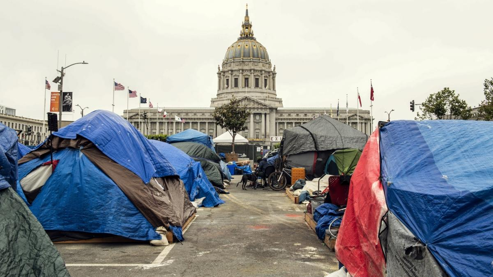

Homelessness population in recent years in the Bay Area is increasing quicker. Regarding the “Bay Area Homelessness: A Regional View of a Regional Crisis'' report that is retrieved from Bay Area Council Economic Institute at http://www.bayareaeconomy.org/report/bay-area-homelessness/, in 2017 there was an estimation of 28,200 individuals were homeless across the nine-county Bay Area which was based on Point-in-Time (PIT) counts. This made the Bay Area the nation's third largest population of people who have been experiencing homelessness. 

As a percentage of the overall population, the Bay Area has the fifth highest homeless concentration in the U.S., with 36 homeless individuals for every 10,000 residents, which is behind New York City (89), Los Angeles (54), Seattle's/King County (53), and Boston (50). The Bay Area also provides less shelter to its homeless population than other regions. In 2017, the Bay Area sheltered about 33% of its homeless population. Between counties within the Bay Area, there is a large difference in the number of homeless populations. For instance, Solano and Santa Clara counties have the highest unsheltered rates; San Francisco is a leader in providing permanent housing. 
 

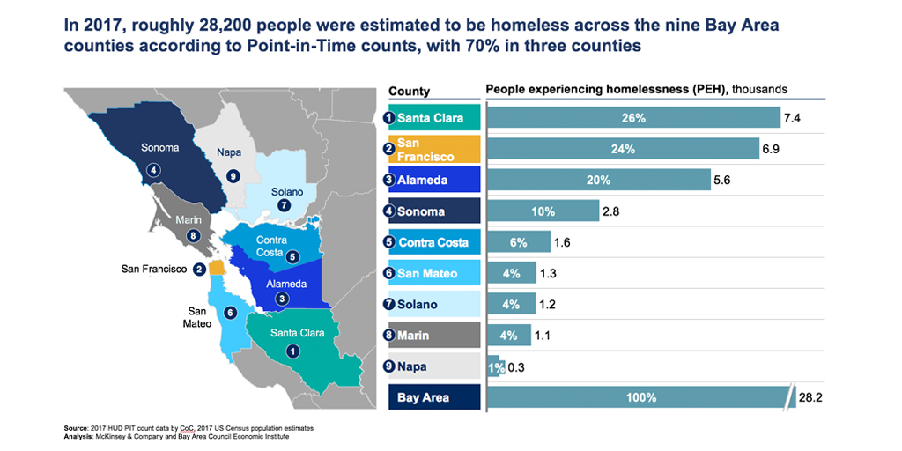

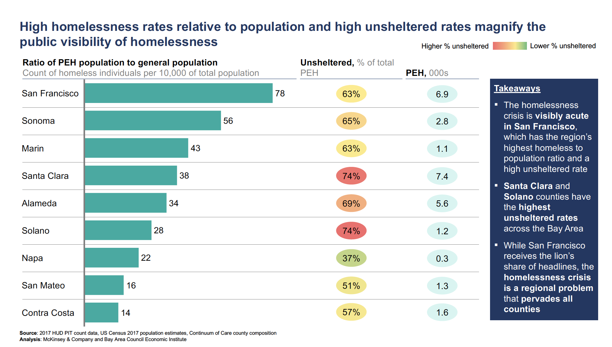

## Bay Area Gentrification and Displacement Analysis

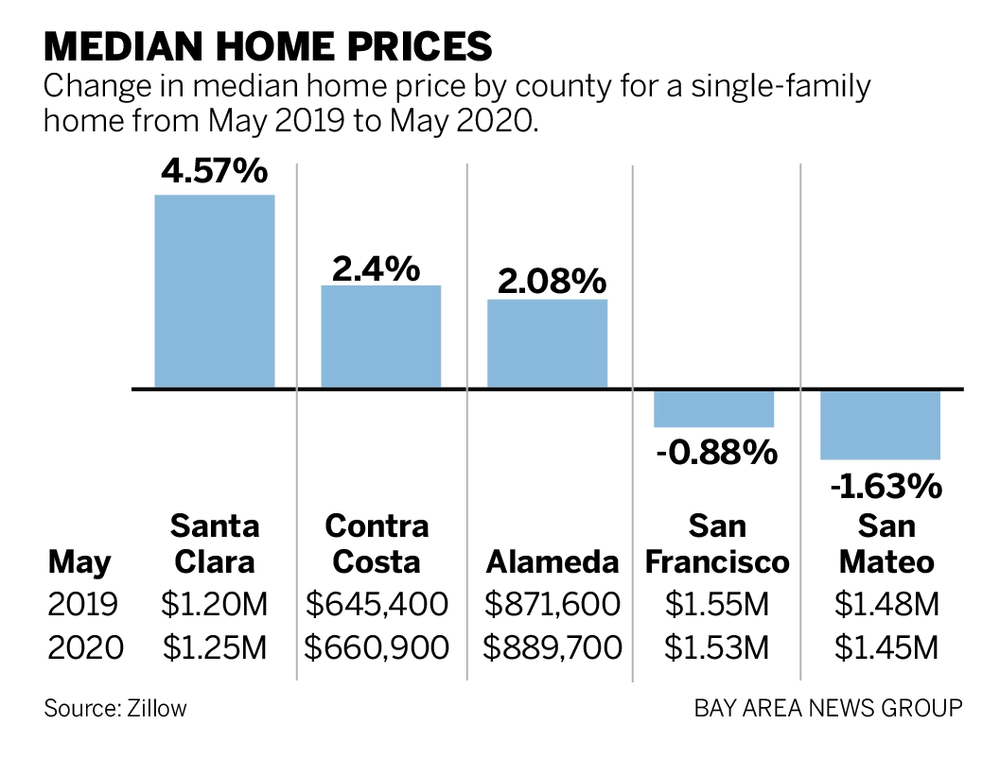

According to Zillow in this chart, median prices for single family homes have risen overtime happening in five of seven counties in May. The highest price is in Santa Clara county. Although the median sale price in San Francisco and San Mateo county dropped about one to two percent, the prices are still higher than Santa Clara county. 

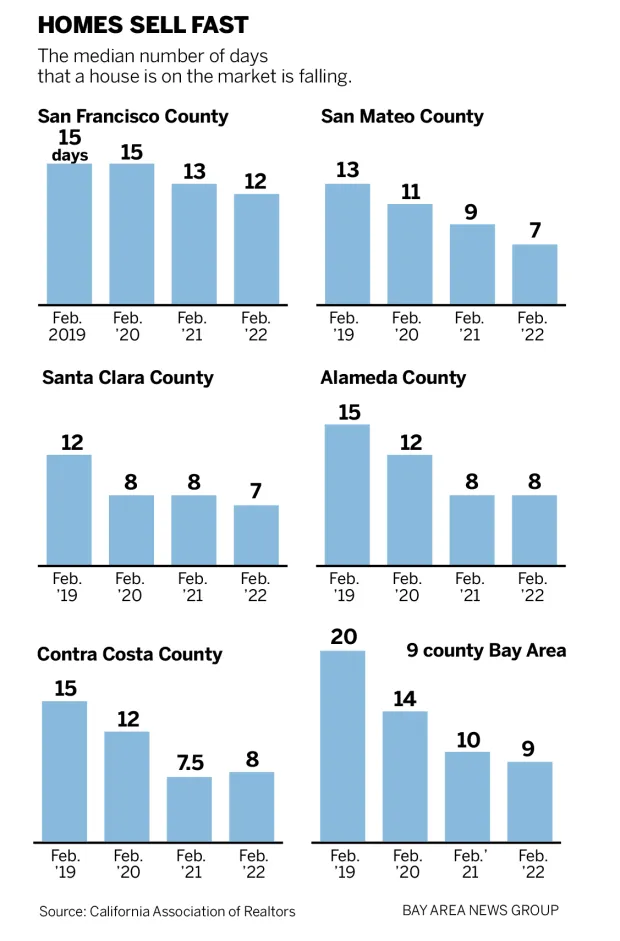

Despite the median sale price in the Bay Area being high, the selling pace is faster overtime. According to the California Association of Realtors’ chart above, the selling pace in San Mateo, Alameda, Contra Costa, and Santa Clara county is about double faster from 2019 to 2020. Overall, in the nine county Bay Area, the pace is about more than double. This means that the pace of gentrification and displacement in the Bay Area has been about double since 2019. 

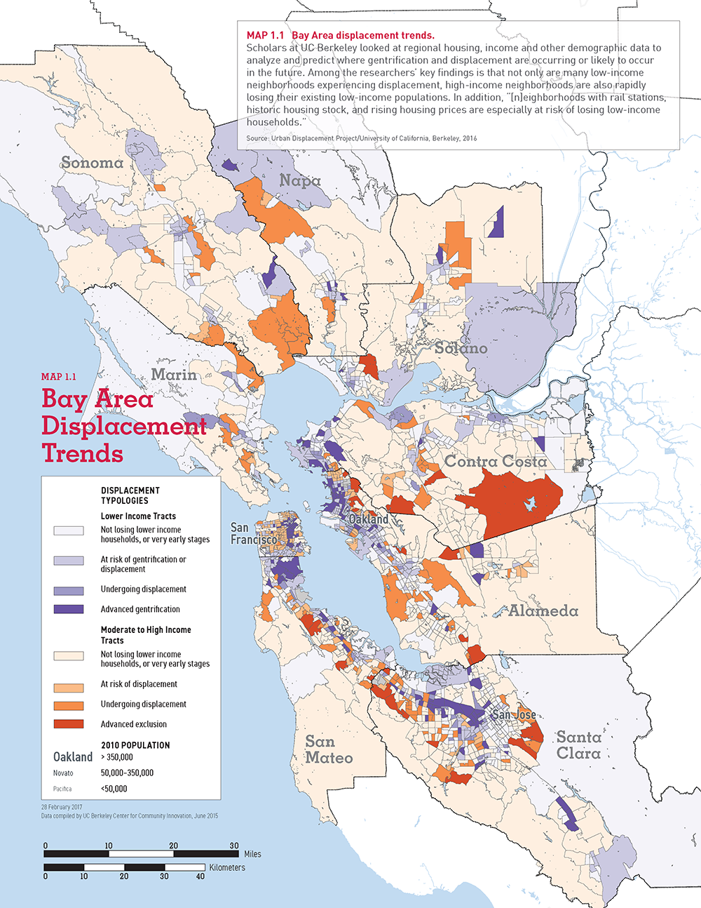
Source: Urban Displacement Project/University of California, Berkeley, 2016

## Homeless Population in the Bay Area

Amongst the general population of the Bay Area, the homeless population is disproportionately composed of homeless men, unaccompanied youth, and people of color. It is also disproportionately composed of single male minorities over the age of 25, LGBTQ+ communities (25%), long-time residents (56% who lived in their county for more than 10 years, and 89% who lived for more than 1 year) 
 
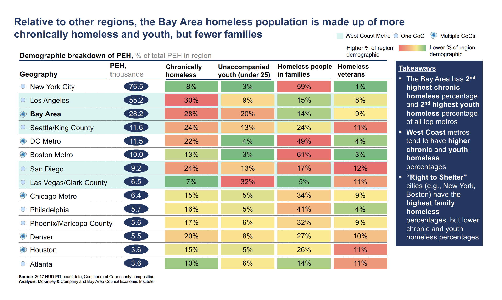

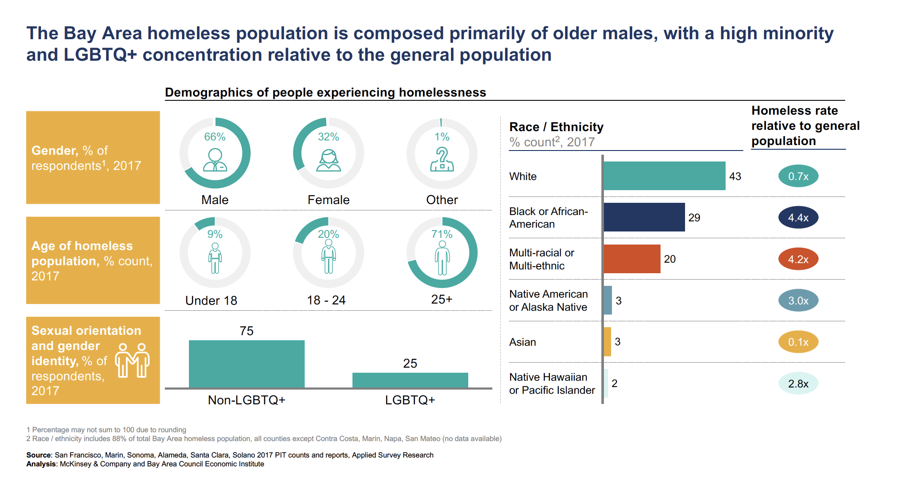

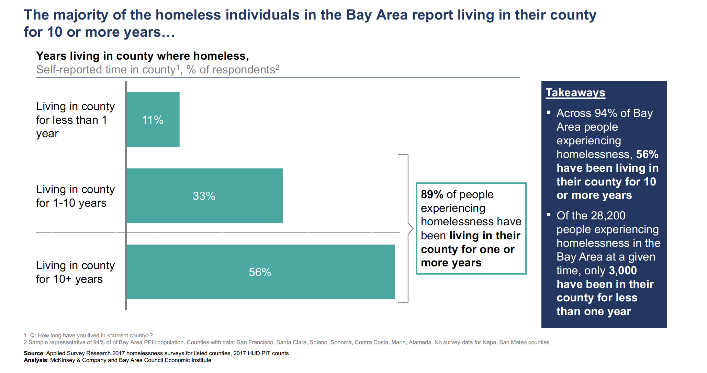

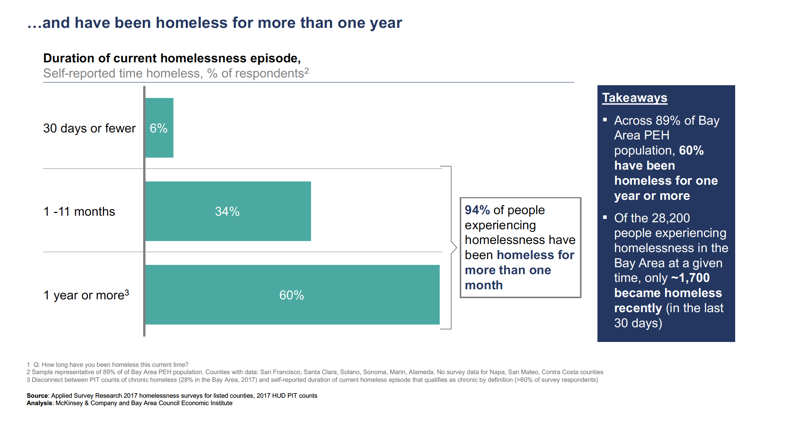

## Homelessness: Causes 

Homelessness often results from causes and circumstances such as job loss, substance abuse, and eviction. Following chart shows the percentage of these cause factors:

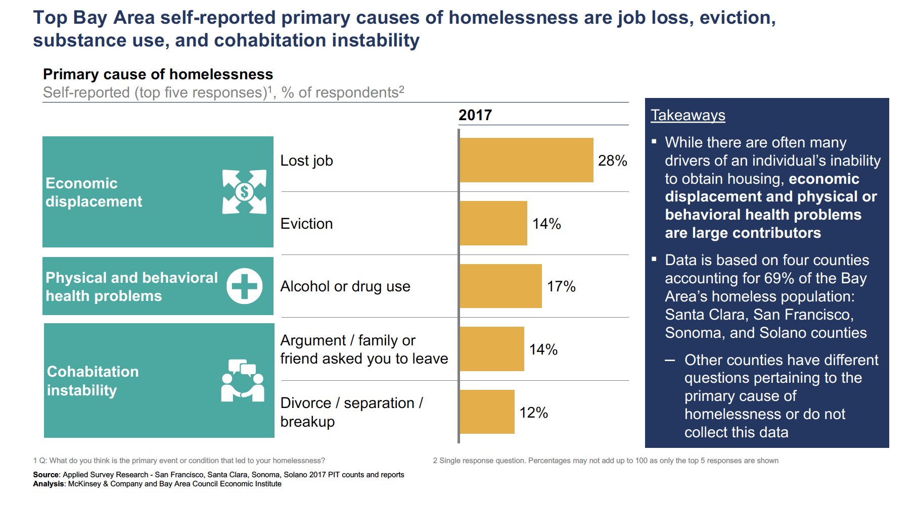

There are also larger historic and economic forces:

1. Housing supply and affordability

2. Insufficient Inventory: shelters, permanent supportive housing, and rapid re-housing

3. Political challenges

4. Insufficient public resources for psychiatric care

5. Urban development history

## Homelessness: Recommendations

1. Improve prevention and diversion programs

2. Expand the housing supply available to extremely low-income households

3. Understand and meet the accommodation need

4. Test and rapidly scale new accommodation models

5. Consolidate existing state programs into new State Homeless Service Agency

6. Explore ways to simplify and strengthen the planning and approval process for housing

7. Develop regional homelessness management plans

8. Launch two regional join task forces on funding and technology

9. Build a plan for private and philanthropic capital to discover business cases that could be funded

10. Use technology to improve homeless services

[editor on GitHub](https://github.com/charlesnguyenberkeley/homelessness/edit/gh-pages/index.md) 

Support or Contact

Having trouble with Pages? Check out our [documentation](https://docs.github.com/categories/github-pages-basics/) or [contact support](https://support.github.com/contact) and we’ll help you sort it out.
